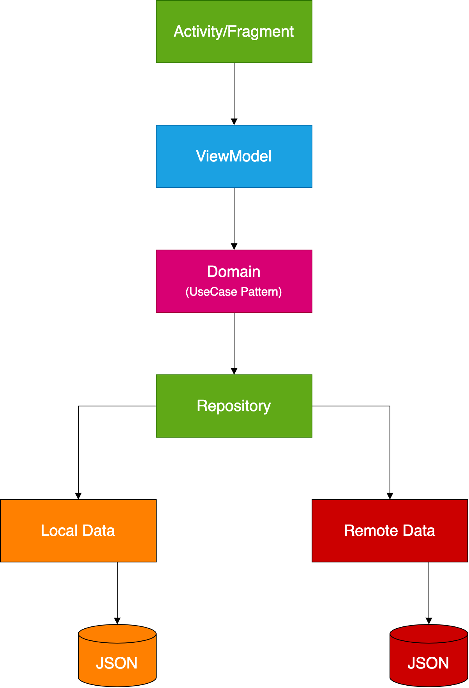
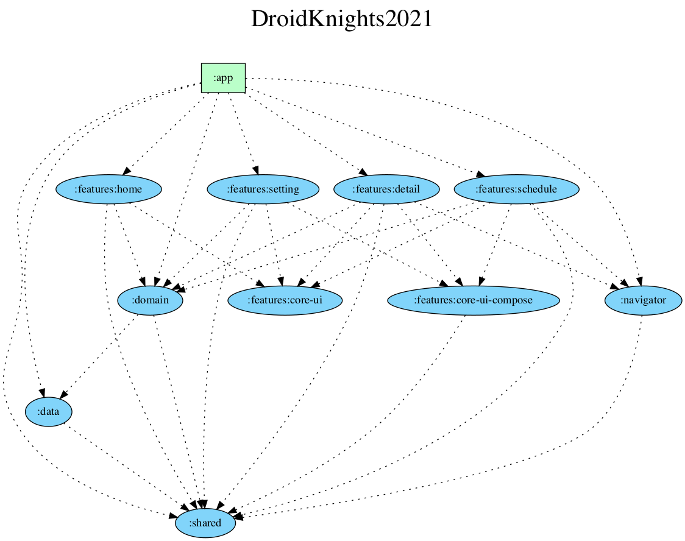
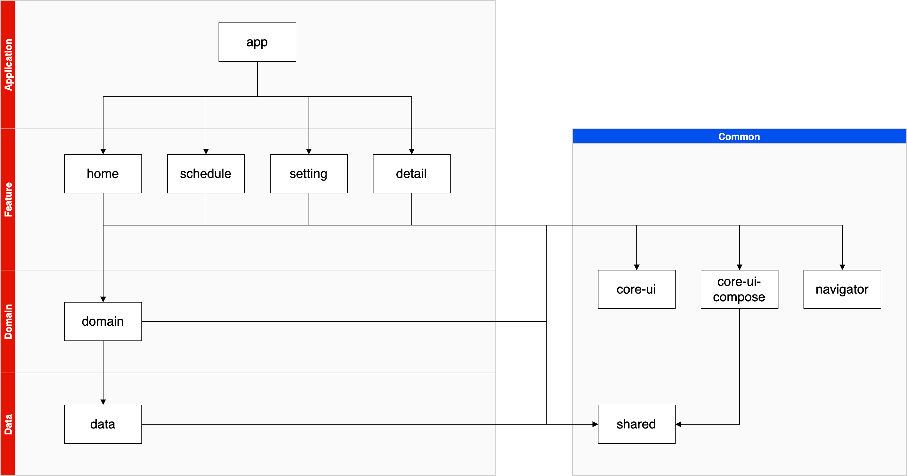

# 🚧🚧🚧 👩‍💻👨‍💻 DroidKnights2021 App 👨‍💻👩‍💻 🚧🚧🚧

드로이드나이츠는 기술 세션으로 개발자들의 경험을 공유하는 안드로이드 컨퍼런스 입니다. 

## Guide

### Contributions Welcome!

드로이드나이츠 행사 정보를 볼 수 있는 앱을 개발하고 있습니다. 여러분들의 참여로 함께 만들어 나가길 기대합니다!

자세한 내용은 [CONTRIBUTING.md](CONTRIBUTING.md) 를 참고해주세요.

## Development

#### Required

- IDE : Android Studio Arctic Fox
- JDK : Java 11을 실행할 수 있는 JDK
  - (권장) Android Studio 설치시 Embeded된 JDK (Open JDK)
  - Java 11을 사용하는 JDK (Open JDK, AdoptOpenJDK, GraalVM)
- Kotlin Language : 1.5.10

#### Laguage

- Kotlin

#### Libraries

- AndroidX
  - Activity & Activity Compose
  - AppCompat
  - Core
  - ConstraintLayout
  - Fragment
  - Lifecycle & ViewModel Compose
  - Navigation
  - RecyclerView
- Google Android Material
- Kotlin Libraries (Coroutine, DateTime, Serialization)
- Compose (1.0.0 or higher)
- Coil & Coil-compose
- Dagger & Hilt
- Accompanist (FlowLayout, Pager)
- Square (Retrofit, OkHttp)
- Timber

### Architecture

#### Layer

본 프로젝트는 Layered Architecture 형태로 설계되어 있습니다. 현재 Presentation/Domain/Data 레이어 구조를 띄고 있습니다.

#### Module

본 프로젝트는 Multi-module 구조이며 각 Feature마다 모듈 형태로 구성되어 있습니다.

**DI Graph**

**DI Graph (Layer)**

## Thanks

참여해주신 모든 분들 감사합니다!

- GitHub : [Contributors](https://github.com/droidknights/DroidKnights2021_App/graphs/contributors)
- Designer : Nayeon Kim

## Trouble Shooting

#### Android Studio Arctic fox에서 JDK 11이 필요함

Arctic fox부터 사용되는 AGP 7.0은 JDK 11이 필요합니다. 현재 JDK가 Java 11을 사용 중인지 확인해주세요.

- 참고 자료 : https://developer.android.com/studio/releases/gradle-plugin#jdk-11

#### Android Studio Arctic fox에서 영어 이외의 언어가 깨져서 노출됨

Android Studio IDE의 일부 메뉴(Git 탭, Preference 등)에서는 영어 이외의 언어가 폰트가 깨진 상태로 렌더링되는 현상이 있습니다. (tofu-ing)

- 해결법 : Preferences | Appearance & Behavior | Appearance에서 `Use custom font`를 체크한 후 별도 폰트를 선택
